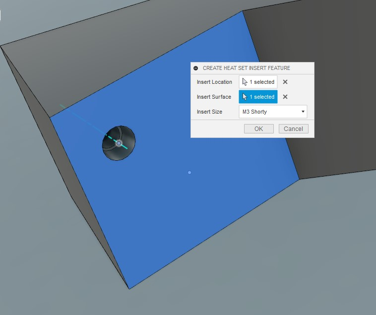

# FusionHeatSetInsertHoleGenerator
Contains source for automating the creation of holes for heat set inserts in Fusion 360

## General 
This repository contains a Python script that uses the Autodesk Fusion 360 API for creating a custom command in Fusion that allows the user to create holes for heat set inserts on 3D printed parts

## Dependencies 
* Autodesk Fusion 360 >2.0.9011
* VS Code >1.50.0

## Setup 
* Create a new addin script in Fusion from the addins menu 
* Fill in the dialogue box for creating a new script. Make sure to toggle Python as the language for the script
* Copy this code into the newly created .py file that Fusion will automatically create. This will end up in a directory created by Fusion located under the details section at the bottom of the addin dialogue box. 
* Copy the manifest file and resources folder in this repo to the directory that Fusion created when creating the new addin 

## Example Use 
* Run the addin script from the Fusion 360 Addins menu. (Shortcut for this is shift+s)
* A command input dialogue will pop up asking the user to select a sketchpoint where the center of the hole will be placed and a surface where the top of the hole will be
* Once the location of the hole has been determined the user can select the type of heat set insert the hole needs to accomodate
* When all command inputs have been provided a preview will appear and the user can click "okay" to execute the script

## Sources 
Hole design is based on guidance given in this article https://markforged.com/resources/blog/heat-set-inserts
